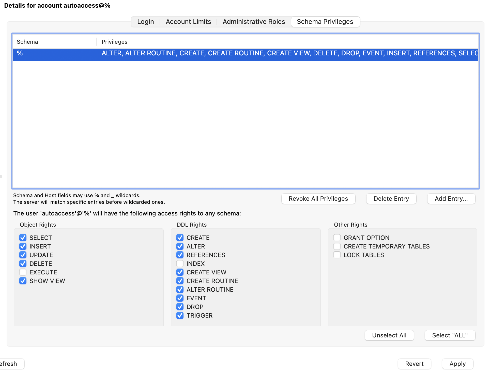
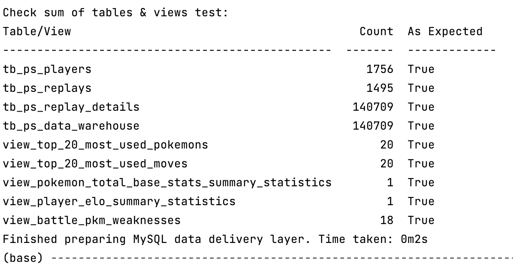
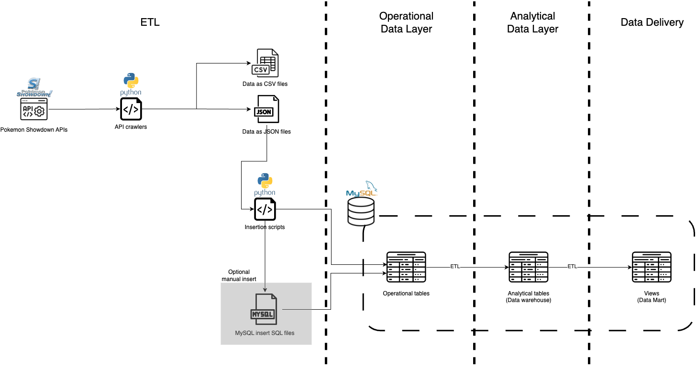
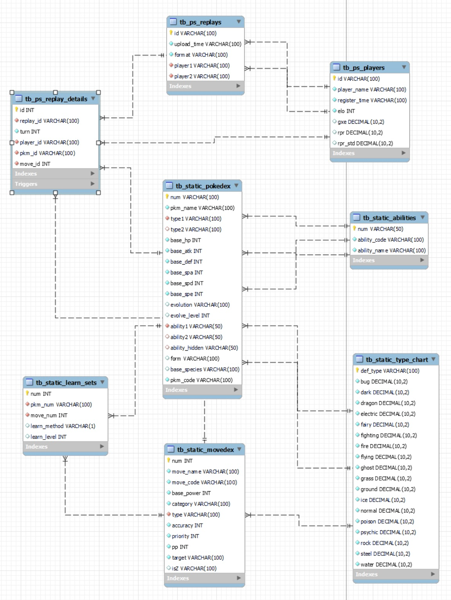
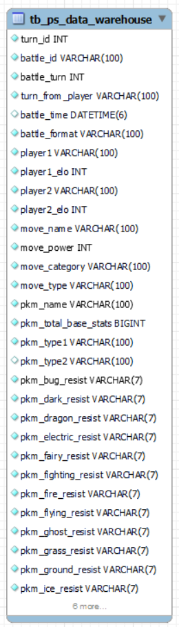
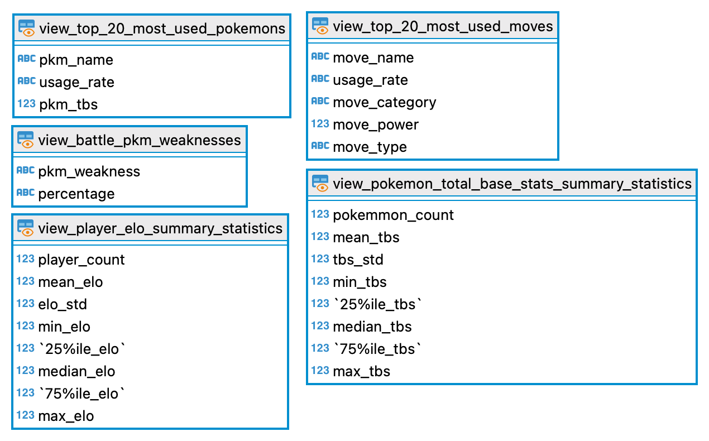

# Pokemon Showdown Data Analytics

This is a project to collect and analyze Pokemon battle game data from `PokemonShowdown.com`. 
> See more detailed explanation in the [Overview](#overview) section

#### Table of Contents
- [Installation](#installation)
- [Usage](#usage)
- [Overview](#overview)
  * [Data Source](#data-source)
- [High Level Architecture](#high-level-architecture)
  * [Operational Data Layer](#operational-data-layer)
  * [Analytical Data Layer](#analytical-data-layer)
  * [Data Delivery Layer](#data-delivery-layer)
  * [Project Directory Structure](#project-directory-structure)
- [Testing](#testing)

-----
## Installation

### 1. Create the MySQL user for the automation scripts

1. In your MySQL Workbench, go to the `Administration` tab.
2. In the `Management` section, go to `Users and Privileges`.
3. Press the `Add Account` button.
4. In the `Login` tab, input the following fields:
   1. Login Name:             `autoaccess`
   2. Password:               `autoaccess`
   3. Confirm Password:       `autoaccess`
5. In the `Schema Privileges` tab, select the following privileges:



6. Press `Apply` button.

### 2. Turn on global variables in MySQL
To allow the automation scripts to create stored procedures and events via console, you need to turn on 
`log_bin_trust_function_creators` and `event_scheduler`.

You can do it by running these SQL statements:
```mysql
SET GLOBAL log_bin_trust_function_creators = ON;
SET GLOBAL event_scheduler = ON;
```

### 3. Install Python depdencies

From command line, `cd` to the directory ``.

Use the package manager [pip](https://pip.pypa.io/en/stable/) to install the denpendencies.

```bash
pip install -r libs/requirements.txt
```

-----
## Usage

From command line, `cd` to the directory ``.

Then run the following commands:

```bash
sh exec/auto_execute_all.sh
```

You can check the process logs in the `log/` directory.

The whole process should take around 3-4 minutes to complete. If successful, you should see a summary like this at the end:



After the process finishes, all data, tables and views should be visible in MySQL `pokemon_showdown` database.

-----
## Overview

This is a project to collect and analyze Pokemon battle game data from `PokemonShowdown.com`.

The output views (Data Marts) should be used as an informative guide to build your double battle teams going against 
popular meta teams currently being used on `PokemonShowdown.com`. They will help you answer the following questions:
1. What are the top most used Pokemons in battle?
2. What are the top most used moves in battle?
3. How powerful (total base stats) your Pokemons should be?
4. How is the distribution of players' elo ranking? What elo range are you expected to be matched up with?
5. What types are most opponents' Pokemons vulnerable to?

### Data Source
All data are programmatically pulled via `PokemonShowdown.com` public APIs. You can check out their documentation [here](https://github.com/smogon/pokemon-showdown).

> See [Operational Data Layer](#operational-data-layer) for more details about how the raw data is stored.

-----
## High Level Architecture


### Operational Data Layer


### Analytical Data Layer


The analytical data layer is constructed using data from tables in the operational data layer:

```mysql
select 
...
from tb_ps_replay_details rd                                    #each turn data
join tb_ps_replays r on r.id = rd.replay_id                     #battle info to get player's data                                       
join tb_ps_players p1 on p1.id = r.player1                      #player 1 info from that turn
join tb_ps_players p2 on p2.id = r.player2                      #player 2 info from that turn
join tb_static_pokedex sp on sp.num = pkm_id                    #pokemon info battling that turn
join tb_static_movedex sm on sm.num = move_id                   #move info that the pokemon used that turn
join tb_static_type_chart stc1 on stc1.def_type = sp.type1      #pokemon's type to deduce weaknesses
left join tb_static_type_chart stc2 on stc2.def_type = sp.type2 #pokemon's type to deduce weaknesses
```

A trigger is set up for after each insertion into the table `tb_ps_replay_details`, an aggregated data entry from 
the operational tables will be inserted into the Analytical Data Layer's table `tb_ps_data_warehouse`.

> See [db_trigger_control](https://github.com/viethngn/CEU_MSc_BA_ECBS5146_Data_Engineering_1/blob/main/sql/db_trigger_control.sql) 
for trigger definitions.

Some data transformations happen when moving data from the Operational Data Layer via stored procedures:
1. Convert battle timestamp from UNIX to human-readable format
2. Calculate the total base stats from each Pokemon's individual stats
3. Deduce a Pokemon's resistance to each type from the Pokemon's type1 and type2

>See [ps_data_warehouse_stored_procedures](https://github.com/viethngn/CEU_MSc_BA_ECBS5146_Data_Engineering_1/blob/main/sql/ps_data_warehouse_stored_procedures.sql) 
for the analytical data layer stored procedure definitions.

### Data Delivery Layer


Each data mart is constructed to answer each of the question in the [Overview](#overview) segment.

#### 1. What are the top most used Pokemons in battle?
```mysql
select * from view_top_20_most_used_pokemons;
```
This view will show you the top 20 most used Pokemons in battles with their usage rate (%) and their total base stats.

#### 2. What are the top most used moves in battle?
```mysql
select * from view_top_20_most_used_moves;
```
This view will show you the top 20 most used Pokemons in battles with their usage rate (%) and their total base stats.

#### 3. How powerful (total base stats) your Pokemons should be?
```mysql
select * from view_pokemon_total_base_stats_summary_statistics;
```
This view will show you the summary statistics of the total base stats of all Pokemon used in battles. It should give 
you a reference to select your Pokemon based on its power.

#### 4. How is the distribution of players' elo ranking? What elo range are you expected to be matched up with?
```mysql
select * from view_player_elo_summary_statistics;
```
This view will show you the summary statistics of the players' elo ranking. With your elo, you can gauge how big the pool 
of your opponent within your elo range.

#### 5. What types are most opponents' Pokemons vulnerable to?
```mysql
select * from view_battle_pkm_weaknesses;
```
This view will provide you which types most opponents' Pokemons are weak to. Pick your Pokemons and moves to target those 
weaknesses.

> An event is set up to refresh all views every 1 minute for the next 30 minutes to keep the views up to date in case any 
testing happens. 
> 
> See [db_event_control](https://github.com/viethngn/CEU_MSc_BA_ECBS5146_Data_Engineering_1/blob/main/sql/db_event_control.sql) 
for event definitions. 
> 
> See [ps_data_mart_stored_procedures](https://github.com/viethngn/CEU_MSc_BA_ECBS5146_Data_Engineering_1/blob/main/sql/ps_data_mart_stored_procedures.sql) 
for the data delivery layer stored procedure definitions.

### Project Directory Structure
```text
Term1
    ├── conf				    //config files
    ├── exec				    //execution scripts
    ├── libs				    //dependencies
    ├── log				    //process logs
    ├── media				    //media files
    ├── replays				    //raw data files
    │   ├── 20231102
    │   ├── 20231103
    │   ├── 20231104
    │   ├── 20231105
    │   └── static_data			    //static data files
    ├── sql				    //SQL automation scripts
    ├── src				    //python source code directory
    │   ├── cache			    //internal cache
    │   ├── const			    //constants
    │   ├── db				    //mysql connector
    │   ├── recovery			    //recover data from files functions
    │   └── utils			    //utilities
    └── test				    //test directory
        └── test_manual_input_data	    //test SQL manual insert data
            ├── tb_ps_players
            ├── tb_ps_replay_details
            └── tb_ps_replays
```

-----
## Testing
You can use the test data in the `test` directory to manually insert the data into MySQL. This is to test the trigger 
and event to refresh the views (views are refreshed every 1 minute for the next 30 minutes).

#### Order of insertion:
1. [tb_ps_players](https://github.com/viethngn/CEU_MSc_BA_ECBS5146_Data_Engineering_1/blob/main/test/test_manual_input_data/tb_ps_players/20231109_21_tb_players.sql)
2. [tb_ps_replays](https://github.com/viethngn/CEU_MSc_BA_ECBS5146_Data_Engineering_1/blob/main/test/test_manual_input_data/tb_ps_replays/20231109_21_tb_ps_replays.sql)
3. [tb_ps_replay_details](https://github.com/viethngn/CEU_MSc_BA_ECBS5146_Data_Engineering_1/blob/main/test/test_manual_input_data/tb_ps_replay_details/20231109_21_tb_ps_replay_details.sql)

